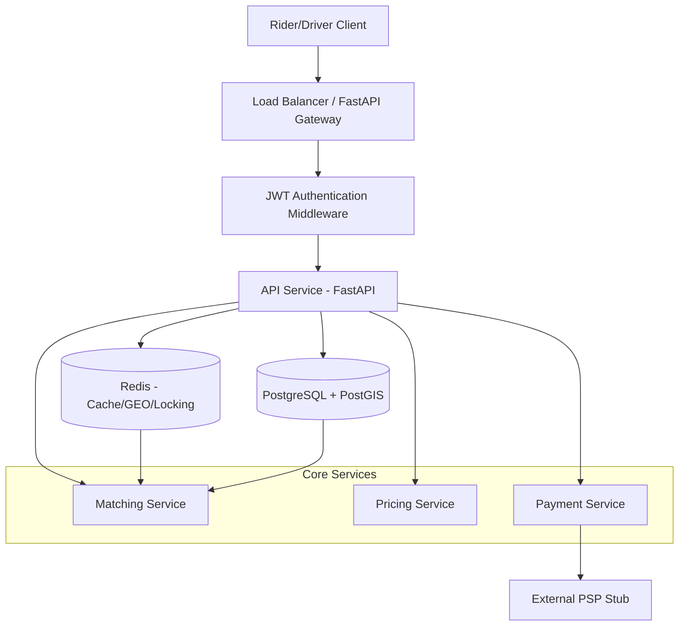

# High-Level Design (HLD) - Ride-Hailing Platform

## 1. Introduction
The GoComet Ride-Hailing Platform is a highly scalable, low-latency backend system designed to handle real-time ride requests, driver location tracking, driver-rider matching, and automated payments. The architecture focuses on high throughput (200k+ location updates/sec) and minimal matching latency (p95 < 1s).

## 2. System Architecture
The system follows a micro-service inspired modular architecture, containerized using Docker.

## 3. Core Components

### 3.1 API Gateway / Web Layer (FastAPI)
- Handles HTTP requests, input validation (Pydantic), and authentication (JWT).
- Asynchronous by design to handle high concurrency.
- Implements Idempotency for critical state-changing requests.

### 3.2 Database Layer (PostgreSQL + PostGIS)
- Source of truth for persistent data: User data, historical trips, and payment records.
- **PostGIS** extension is used for efficient spatial indexing and distance calculations.
- **PgBouncer** is used as a connection pooler to manage database connections efficiently.

### 3.3 Caching & Spatial Layer (Redis)
- **GEO Index**: Stores real-time driver locations using `GEOADD`.
- **Fast Matching**: Uses `GEOSEARCH` to find drivers within a radius in sub-millisecond time.
- **Cache-Aside**: Caches ride status to reduce database load for status polling.
- **Distributed Locking**: Manages driver allocation locks to prevent double-booking.

### 3.4 Matching Engine
- Orchestrates the pairing of riders and drivers. 
- Filters drivers by availability, proximity, and service tier.
- Runs asynchronously to keep API response times low.

### 3.5 Pricing Service
- Computes trip fares based on distance and dynamic surge pricing.
- Surge is calculated based on the supply-demand ratio in specific spatial regions.

## 4. Key Workflows

### 4.1 Ride Request Lifecycle
1. Rider requests a ride (`POST /v1/rides`).
2. System calculates estimated fare and surge.
3. Ride is persisted in DB with `REQUESTED` status.
4. Matching engine finds the nearest driver and transitions ride to `MATCHED`.

### 4.2 Location Tracking
1. Drivers push location updates (`POST /v1/drivers/{id}/location`) every few seconds.
2. Updates are written into Redis GEO index (Hot Path).
3. Locations are asynchronously synced to PostgreSQL for historical tracking.

### 4.3 Payment Workflow
1. At trip end, fare is finalized.
2. Rider triggers payment (`POST /v1/payments`).
3. System validates fare, calls PSP, and updates status to `COMPLETED`.

## 5. Scalability & Performance
- **Horizontal Scaling**: Stateless FastAPI workers can scale behind a load balancer.
- **Micro-batching**: Background tasks handle non-critical writes (e.g., location persistence).
- **In-Memory Operations**: Critical path (matching/location) relies on Redis for speed.

## 6. Monitoring & Observability
- **New Relic APM**: Monitors transaction traces, database query performance, and error rates.
- **Alerting**: Based on p95 latency thresholds and service error rates.
